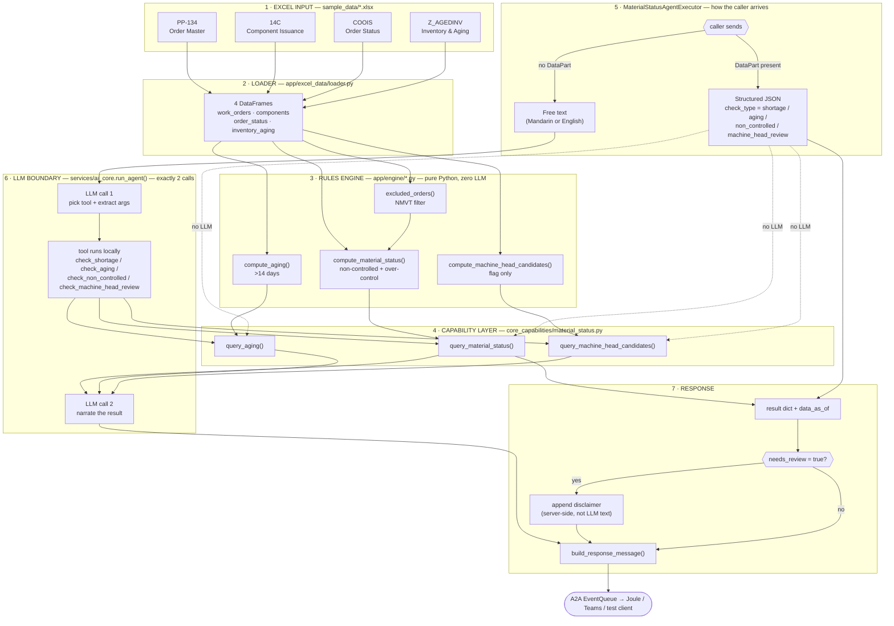

# Smart Material AI — Excel-Backed Rules Engine & Agent/Tool Architecture

This document covers the piece of the system that sits *underneath* the live-S/4HANA
A2A agents already in `app/`: a source-agnostic pipeline that turns the four raw SAP
report exports in `sample_data/` into deterministic material-status answers (shortage,
over-control, aging, machine-head review).

It complements [ARCHITECTURE_FLOW.md](ARCHITECTURE_FLOW.md) (full target BTP/Joule/Teams
deployment) and the [README](README.md) (existing A2A transport layer). This is the
build spec for the Excel-upload / PoC data path (Technical Spec §4.2).

Source docs: `Spec/Functional_Specification_Smart_Material_AI_Chat.docx`,
`Spec/Technical_Specification_Smart_Material_AI_Chat.docx`.

## End-to-end flow chart



Reading it: solid arrows are plain data flow; the dashed arrows out of `JSONP` mark the
structured path bypassing the LLM entirely; box `LLMB` is the *only* place a model runs,
and only for free text, exactly twice per turn (routing, then narration) — never for
computation.

## Current phase scope: Excel-only, no adapter abstraction yet

Everything below drops the `DataSource`/`adapters/` dual-source layer from earlier
drafts of this document — that abstraction only earns its keep once a second source
(live S/4 CDS/OData) actually exists. Right now there is exactly one source
(`sample_data/*.xlsx`), so the pipeline is deliberately flat:

```
sample_data/*.xlsx  →  app/excel_data/loader.py  →  app/engine/*.py  →  core_capabilities  →  agent/tools
```

If/when live S/4 integration is actually built, `loader.py`'s four functions get a
sibling module with the same four function signatures reading from OData instead of
Excel — that's the only future-proofing this phase needs; no protocol class, no
interface, no second implementation to maintain until that day actually comes.

### `app/excel_data/loader.py` — one function per source file

Real headers, verified against the files in `sample_data/` (not assumed):

```python
import pandas as pd

SAMPLE_DATA_DIR = "sample_data"

def load_component_issuance() -> pd.DataFrame:
    """RAW_14C_ComponentIssuance.xlsx, sheet 'Component Issuance (14C)'.
    Columns K and L are BOTH literally named 'B' in the source file (a real
    export quirk) - pandas auto-renames the second to 'B.1'. Neither is used
    by any rule below, so they're dropped rather than disambiguated."""
    df = pd.read_excel(f"{SAMPLE_DATA_DIR}/RAW_14C_ComponentIssuance.xlsx",
                        sheet_name="Component Issuance (14C)")
    return df[["Order", "Type", "Material", "Component", "Storage Location",
               "QtyPer", "TheoUsg (WtScp)", "Net GI (CO11N)", "Net GI (Other)",
               "Actual Usage"]]

def load_order_master() -> pd.DataFrame:
    """RAW_PP134_OrderMaster.xlsx, sheet 'Order Master (PP-134)'."""
    df = pd.read_excel(f"{SAMPLE_DATA_DIR}/RAW_PP134_OrderMaster.xlsx",
                        sheet_name="Order Master (PP-134)")
    return df[["Order", "Type", "Material", "Issuance Location", "Order Qty",
               "Yield Qty", "Scrap Qty", "Ord Start", "Ord Finish", "Work Center"]]

def load_order_status() -> pd.DataFrame:
    """RAW_COOIS_OrderStatus.xlsx, sheet 'Order Status (COOIS)'. Only 2 columns."""
    return pd.read_excel(f"{SAMPLE_DATA_DIR}/RAW_COOIS_OrderStatus.xlsx",
                          sheet_name="Order Status (COOIS)")

def load_inventory_aging() -> pd.DataFrame:
    """RAW_ZAGEDINV_Inventory.xlsx, sheet 'Inventory & Aging (Z_AGEDINV)'."""
    df = pd.read_excel(f"{SAMPLE_DATA_DIR}/RAW_ZAGEDINV_Inventory.xlsx",
                        sheet_name="Inventory & Aging (Z_AGEDINV)")
    return df[["Material", "Storage Location", "Plant", "Unrestricted",
               "Aging Days", "Standard price", "Last Placement Date"]]
```

Nothing here computes a rule — it only reads a named sheet and selects the columns the
rules actually need. `requirements.txt` needs `pandas` added for this (not currently
listed — `openpyxl` is, which `pandas.read_excel` uses as its engine underneath).

### `app/engine/order_status.py` — exclusion, computed first

```python
def excluded_orders(order_status_df: pd.DataFrame) -> set[str]:
    """Orders with COOIS User Status 'NMVT' - excluded before any rule runs."""
    return set(order_status_df.loc[order_status_df["User Status"] == "NMVT", "Order"])
```

### `app/engine/material_status.py` — non-controlled + over-control (shared join)

Both rules come from the same lookup, so they're one function, not two:

```python
from datetime import datetime, timezone

def compute_material_status(components_df, inventory_df, order_status_df,
                             *, work_order=None, material=None, storage_location=None):
    excluded = excluded_orders(order_status_df)
    comp = components_df[~components_df["Order"].isin(excluded)].copy()

    # remaining issuance per component row = theoretical usage minus what's
    # actually been issued against it so far
    comp["remaining_issuance"] = (
        comp["TheoUsg (WtScp)"] - comp["Net GI (CO11N)"] - comp["Net GI (Other)"]
    )

    requirement = (
        comp.groupby(["Component", "Storage Location"], as_index=False)
            .agg(controlled_remaining_issuance=("remaining_issuance", "sum"),
                 orders=("Order", lambda s: sorted(set(s))))
            .rename(columns={"Component": "Material"})
    )

    merged = inventory_df.merge(requirement, on=["Material", "Storage Location"], how="left")

    merged["available_to_issue_qty"] = merged["Unrestricted"] - merged["controlled_remaining_issuance"]
    merged["material_status"] = merged.apply(
        lambda r: "non_controlled" if pd.isna(r["controlled_remaining_issuance"])
                  else ("over_control" if r["available_to_issue_qty"] < 0 else "available"),
        axis=1,
    )

    if material:
        merged = merged[merged["Material"] == material]
    if storage_location:
        merged = merged[merged["Storage Location"] == storage_location]
    if work_order:
        merged = merged[merged["orders"].apply(lambda os: isinstance(os, list) and work_order in os)]

    merged["data_as_of"] = datetime.now(timezone.utc).isoformat()
    return merged.to_dict("records")
```

`query_material_status(..., status_filter="non_controlled")` in `core_capabilities` is
just `[r for r in compute_material_status(...) if r["material_status"] == "non_controlled"]`
— no second engine function for the non-controlled rule.

### `app/engine/aging.py`

```python
def compute_aging(inventory_df, *, material=None, storage_location=None):
    df = inventory_df.copy()
    df["is_aged"] = df["Aging Days"] > 14          # fixed threshold, not a parameter
    if material:
        df = df[df["Material"] == material]
    if storage_location:
        df = df[df["Storage Location"] == storage_location]
    df["data_as_of"] = datetime.now(timezone.utc).isoformat()
    return df[["Material", "Storage Location", "Aging Days", "is_aged",
               "Plant", "data_as_of"]].to_dict("records")
```

### `app/engine/machine_head.py` — candidates only, never resolved

```python
def compute_machine_head_candidates(order_master_df, components_df, *, order_type="ZNPC"):
    znpc_orders = set(order_master_df.loc[order_master_df["Type"] == order_type, "Order"])
    candidates = components_df[
        components_df["Order"].isin(znpc_orders) & (components_df["Net GI (CO11N)"] > 0)
    ].copy()
    candidates["needs_review"] = True               # unconditional - read by the
                                                       # agent to force the disclaimer
    candidates["data_as_of"] = datetime.now(timezone.utc).isoformat()
    return candidates[["Order", "Component", "Storage Location",
                        "Net GI (CO11N)", "needs_review", "data_as_of"]].to_dict("records")
```

This is a heuristic surfacing query, not a rule — it will always over- or under-flag
relative to the SME's manual judgment (Functional Spec §4.4: 10 of 3,123 rows in the
reviewed sample), which is exactly why its output field is `needs_review`, not `status`.

### Not implemented — confirmed still open

"Buck material" exclusion and "-S" suffix material handling are not in any engine
function above. The `-S` note lives in the 14C file's own "SME Process Notes" sheet
("S3: Filter '-S' materials and check whether Column O has a value" — Column O is
`QtyPer`), but no confirmed rule exists to code against (Functional Spec Open Q1/Q2).
Do not guess a rule here — flag rows matching `-S` as a data-quality note if useful, but
don't fold them into `material_status`.

## Decision — what gets built, exactly

**One new agent. Four tools. Exactly two LLM calls per free-text turn, zero for
structured callers, and zero anywhere else in the system.**

| Layer | File | Contents |
|---|---|---|
| Data source | `app/adapters/base.py` | `DataSource` protocol — 5 methods, no logic |
| Data source | `app/adapters/excel_adapter.py` | `ExcelDataSource` — reads the 4 files in `sample_data/`, implements the protocol |
| Rules | `app/engine/order_status.py` | `excluded_orders()` — COOIS NMVT filter |
| Rules | `app/engine/material_status.py` | `compute_material_status()` — non-controlled + over-control (shared join) |
| Rules | `app/engine/aging.py` | `compute_aging()` |
| Rules | `app/engine/machine_head.py` | `compute_machine_head_candidates()` |
| Capability | `app/core_capabilities/material_status.py` | `query_material_status()`, `query_aging()`, `query_machine_head_candidates()` — exactly 3 functions, source-agnostic |
| Agent | `app/a2a_agents/material_status_agent.py` | `MaterialStatusAgentExecutor` — the **only** new agent, **the only** call site for `run_agent()` |
| Wiring | `app/main.py` | one more entry in `_AGENTS`, mounted exactly like `query`/`action`/`report` |

No orchestrator, no per-rule agents, no sub-agent delegation. `engine/*.py` functions
are plain synchronous Python — no `async`, no model calls, no imports from
`langchain`/`gen_ai_hub` anywhere in that directory. That's the actual guarantee that
business logic can't be "interrupted" by the LLM: the functions that compute shortage,
aging, and over-control are physically incapable of calling a model, because nothing in
that file imports one.

## Full inventory — all 4 agents, 12 tools, across the whole app

The three agents below already exist and are unchanged; the fourth is the one this
document builds. Every agent follows the identical structured/free-text contract.

| # | Agent (file) | What it does | Tools bound (count) | Structured dispatch key |
|---|---|---|---|---|
| 1 | **Material Query Agent**<br>`a2a_agents/query_agent.py` | Read-only lookups: material master (MM03), stock (MMBE), production order (COOIS) | `lookup_material_stock`, `lookup_material_master`, `lookup_production_order` **(3)** | `query_type` |
| 2 | **Material Action Agent**<br>`a2a_agents/action_agent.py` | Create/update material master, delete description (MM01/MM02) | `update_material_status`, `update_material_description`, `create_material`, `delete_material_description` **(4)** | `action` |
| 3 | **Material Report Agent**<br>`a2a_agents/report_agent.py` | Generates a downloadable PDF/Excel/CSV report | `generate_report` **(1)** | `report_type` |
| 4 | **Material Status Agent** *(new — this build)*<br>`a2a_agents/material_status_agent.py` | The 4 business rules: shortage/over-control, aging, non-controlled, machine-head review | `check_shortage`, `check_aging`, `check_non_controlled`, `check_machine_head_review` **(4)** | `check_type` |

**Totals: 3 + 4 + 1 + 4 = 12 tools across 4 agents.** No tool is shared between agents —
each wraps exactly one `core_capabilities` function.

### The LLM mechanism — identical in all 4 agents

| Branch | Trigger | What happens | LLM calls |
|---|---|---|---|
| Structured | Caller sends a JSON DataPart (`query_type`/`action`/`report_type`/`check_type`) — the real Joule-skill-invocation shape | Dispatched straight to the matching `core_capabilities` function via a plain `if/elif` | **0** |
| Free text | Caller sends plain text, no DataPart | `run_agent(system_prompt, tools, text)` — one call, using that agent's own tool list and system prompt | **2**, always, regardless of how many tools get used |

The 2 LLM calls, every time, for every agent:

1. **Call 1 — routing.** Model gets the system prompt + that agent's tool schemas
   (auto-built from each `@tool`'s docstring/type hints) + the user's text. Picks which
   tool(s) to call and extracts arguments. Does not answer yet.
2. *(tool runs — plain Python, no model — this is where `core_capabilities`/`engine` do
   the real work)*
3. **Call 2 — narration.** Same agent loop, now holding the tool's JSON result, produces
   the final sentence. It describes the number; it never calculates one.

Agent-specific difference is only what gets appended **after** call 2, outside the
model's control: Report always appends the literal `download_url` itself (a model could
garble a URL); Material Status appends the machine-head disclaimer the same way,
unconditionally, whenever `needs_review=True` appears in a tool result.

## The rule formulas (resolved, not open)

Grain: every computed row is keyed by **Material + Storage Location** (not
WorkOrder + Component) — that's what the confirmed lookup formula operates on. Shortage
lookups by work order join back onto this via the components table.

```python
# engine/order_status.py
def excluded_orders(order_status_df) -> set[str]:
    # Order where UserStatus == 'NMVT' → excluded before anything else runs
    ...

# engine/material_status.py
def compute_material_status(components_df, stock_df, order_status_df,
                             *, work_order=None, material=None, storage_location=None) -> list[dict]:
    # 1. drop rows whose Order is in excluded_orders(order_status_df)
    # 2. controlled_remaining_issuance = groupby(Component, StorageLocation)
    #        [TheoUsg(WtScp) - ActualUsage].sum()
    # 3. left-join stock_df (Material+StorageLocation) onto that grouped requirement
    # 4. status =
    #      'non_controlled' if requirement is NaN (no match)
    #      'over_control'   if (unrestricted_stock - requirement) < 0
    #      'available'      otherwise
    # 5. filter by work_order / material / storage_location if given
    # 6. attach data_as_of=now(), contributing_orders=[...]
    ...

# engine/aging.py
def compute_aging(aging_df, *, material=None, storage_location=None) -> list[dict]:
    # is_aged = AgingDays > 14 (fixed threshold, not a parameter)
    ...

# engine/machine_head.py
def compute_machine_head_candidates(work_orders_df, components_df, *, order_type="ZNPC") -> list[dict]:
    # order_type == 'ZNPC' AND has prior GI history in components_df
    # every returned row carries needs_review=True unconditionally — this is
    # read by the agent layer to force the disclaimer (see below), not just
    # a display hint
    ...
```

`core_capabilities/material_status.py` is the only thing that instantiates
`ExcelDataSource()` and calls these — it is the sole place that knows the current
source is Excel; swapping to `S4DataSource` later touches this file's constructor call
and nothing else.

## Tools and the one agent

`app/a2a_agents/material_status_agent.py` — one `AgentSkill`, four tools:

```python
@tool
def check_shortage(work_order: str = "", material: str = "", storage_location: str = "") -> dict:
    """Check material shortage / over-control status."""
    return query_material_status(work_order=work_order or None, material=material or None,
                                  storage_location=storage_location or None)

@tool
def check_aging(material: str = "", storage_location: str = "") -> dict:
    """List inventory aged beyond 14 days."""
    return query_aging(material=material or None, storage_location=storage_location or None)

@tool
def check_non_controlled(storage_location: str = "") -> dict:
    """List non-controlled (无管制料) material."""
    return query_material_status(storage_location=storage_location or None, status_filter="non_controlled")

@tool
def check_machine_head_review(order_type: str = "ZNPC") -> dict:
    """Surface machine-head material (机头料) CANDIDATES for human review only."""
    return query_machine_head_candidates(order_type=order_type)

_TOOLS = [check_shortage, check_aging, check_non_controlled, check_machine_head_review]
```

`check_non_controlled` is not a separate engine function — it's `check_shortage`'s same
underlying computation with `status_filter="non_controlled"`, because both rules come
out of the same join (Section above). Don't build a second join for it.

**Machine-head enforcement is structural, not a prompt request.** `MaterialStatusAgentExecutor`
inspects the tool output after `run_agent()` returns; if any result has `needs_review: True`,
the executor appends a fixed, code-authored disclaimer string to the response text —
*after* the LLM's narration, unconditionally. The model's phrasing can't remove it because
the model never sees or controls that step; it's plain string concatenation in the
executor, not part of the system prompt.

## Where the LLM is invoked — exactly one call site, exactly twice per turn

```python
class MaterialStatusAgentExecutor(AgentExecutor):
    async def execute(self, context, event_queue):
        args = get_structured_input(context)

        if args is not None:
            # STRUCTURED PATH — zero LLM calls, ever.
            result, summary = _run_structured_check(args)   # if/elif on check_type
            await event_queue.enqueue_event(build_response_message(context, summary, result))
            return

        # FREE-TEXT PATH — the only place run_agent() is called anywhere for this agent.
        text = context.get_user_input()
        agent_result = await run_agent(_AGENT_SYSTEM_PROMPT, _TOOLS, text)
        answer, tool_outputs = agent_result
        if any(r.get("needs_review") for r in tool_outputs):
            answer += "\n\n⚠ This includes machine-head candidates — needs human confirmation, not a resolved status."
        await event_queue.enqueue_event(build_response_message(context, answer, {"tool_results": tool_outputs}))
```

Inside `run_agent()` (`app/services/ai_core.py`, unchanged, already built):

1. **LLM call #1** — model receives the system prompt + the 4 tool schemas (auto-generated
   from the `@tool` docstrings/type hints above) + the user's raw text. It returns a tool
   call with extracted arguments (e.g. `check_shortage(work_order="121058014")`). This is
   the only place any "understanding" of the question happens.
2. The named Python function runs **locally**, synchronously — no model involved —
   through `core_capabilities` → `engine`, and returns a plain dict.
3. **LLM call #2** (same agent loop) — model sees the tool's dict result and produces a
   sentence. It narrates the number; it never computes one.

That's it — two calls, one router turn, bounded regardless of how many tools get
invoked in step 1 (multi-tool calls in the same turn are one `run_agent()` call, not one
per tool). No other file in the system calls `run_agent()`, `create_agent()`,
`init_llm()`, or anything from `gen_ai_hub`/`langchain` for this feature. Structured
callers (real Joule skill invocations with pre-extracted fields) never reach step 1 at
all — they hit `_run_structured_check()` and return before `run_agent` is even imported
into the call stack.

## Wiring into the app

`app/main.py` already mounts three sub-apps identically (`query`, `action`, `report`).
Add a fourth entry, no other change needed:

```python
_AGENTS = {
    "query": (build_query_agent_card, QueryAgentExecutor),
    "action": (build_action_agent_card, ActionAgentExecutor),
    "report": (build_report_agent_card, ReportAgentExecutor),
    "material_status": (build_material_status_agent_card, MaterialStatusAgentExecutor),
}
```

## Build order

1. `adapters/base.py` + `adapters/excel_adapter.py` — read the 4 files, return the 5
   DataFrames. Verify columns/row counts against `sample_data/` directly (no rules yet).
2. `engine/order_status.py`, `engine/material_status.py`, `engine/aging.py`,
   `engine/machine_head.py` — pure functions, unit-tested against the SME's golden
   workbook, no agent/tool/LLM code touched yet.
3. `core_capabilities/material_status.py` — wraps 1+2, still zero LLM, testable via
   plain function calls or `pytest`.
4. `a2a_agents/material_status_agent.py` + the `main.py` entry — structured path only
   first (`check_type` dispatch), confirm it responds correctly over JSON-RPC.
5. Add the 4 `@tool` wrappers and wire `run_agent()` for the free-text branch last —
   only once 1–4 are proven correct against the golden workbook independent of any LLM.
